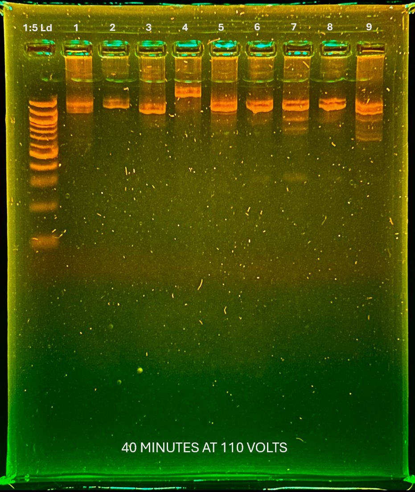

*recleaning samples with 300 bp band from [1.30.2026 reclean](1.30.2026%20reclean.md)
 
**sample 1:** 92022_PAN_BDT_T1_2_CNAT (Sample 1 from 1.15.2026)
**sample 2:** 92022_PAN_BDT_T1_3_CNAT  (Sample 2 from 1.15.2026)
**sample 3:** 92022_PAN_BDT_T2_48_CNAT  (Sample 3 from 1.15.2026)
**sample 4:** 102023_PAN_BDT_T3_308_CNAT (Sample 5 from 1.15.2026)
**sample 5:** 102023_PAN_BDT_T3_310_CNAT (Sample 6 from 1.15.2026)
**sample 6:** 072024_PAN_BDT_T1_592_CNAT (Sample 7 from 1.15.2026)
**sample 7:** 072024_PAN_BDT_T3_692_CNAT (Sample 9 from 1.15.2026)
**sample 8:**  072024_PAN_BDT_T1_598_CNAT (Sample 8 from 1.15.2026)
**sample 9:** 072024_PAN_BDT_T3_693_CNAT (Sample 10 from 1.15.2026)
## Jan 28 Cleaned Sample Gel 

*notes:*
- *need to reclean samples 6-9 to remove faint 300 bp band* 
	- *Caroline says that sometimes the beads just don't clean everything sometimes*
*not sure if the smudging was reduced enough for sequencing but we are going to try it and see the quality of the result*
# DONE IN POST PCR ROOM
## Purification with ampure beads
https://www.beckman.com/reagents/genomic/cleanup-and-size-selection/pcr/bead-ratio
### Purification Preparation
- obtain, label, and cross-link new strip tubes start with the manufacturer protocol using 1.8X-1.0X DNA to bead ratio and 10uL-25uL PCR product 
- ratio of beads will change the size you select for 
	*may need to re-clean samples if gel images show that multiple bands were not removed*
	- *1.0x will get rid of <200 bp dimers, 1.8X will get rid of dimer <100 bp* 
- all calculations can be done here: [https://docs.google.com/spreadsheets/d/1O_NJCFvnBztKm_G88Sx-gEKD7CwR44iEaRjyxS_N32E/edit?gid=1947158502#gid=1947158502](https://docs.google.com/spreadsheets/d/1O_NJCFvnBztKm_G88Sx-gEKD7CwR44iEaRjyxS_N32E/edit?gid=1947158502#gid=1947158502) 
### Purification 
1. make fresh 80% ethanol in a 50mL tube (label and parafilm when not in use)
    - paste filled out table here

| (Sample 1 from 1.15.2026) | 80% EtOH for each sample (uL) | Total 80% EtoH needed (uL) | Volume 100% EtOH (uL) | Volume H2O (uL) |
| ------------------------- | ----------------------------- | -------------------------- | --------------------- | --------------- |
| 9                         | 360                           | 3240                       | 2592                  | 648             |
|                           |                               | in mL                      |                       |                 |
|                           |                               | 3.24                       | 2.592                 | 0.648           |

2. Determine whether or not a plate transfer is necessary. If the PCR reaction volume multiplied by 2.8 exceeds the volume of the PCR plate, a transfer to larger tubes is required.
3. Gently shake the Clean NGS Mag PCR Clean-up aliquot to resuspend any Magnetic particles that may have settled.
    1. Add CleanN GS Mag PCR Clean-up volume table below:

| Bead Concentration | PCR volume (uL) | Added beads volume (uL) | Total # Samples | Total Bead Volume (uL) |     |     |
| ------------------ | --------------- | ----------------------- | --------------- | ---------------------- | --- | --- |
| 0.6                | 24              | 14.4                    | 9               | 129.6                  |     |     |

**Note:** The volume of CleanNGS Mag PCR Clean-up for a given reaction can be determined from the following equation:  
_(Volume of Mag Beads per reaction) = (Bead Concentration) x (PCR Reaction Volume)_

3. Mix reagent and PCR reaction thoroughly by pipette mixing 5 times.
4. Incubate the mixed samples for 5 minutes at room temperature for maximum recovery. 
	*This step allows the binding of PCR products 125bp (based on concentration) and greater to the Magnetic beads. After mixing, the color of the mixture should appear homogenous.*
5. Place the reaction plate onto a 96 well Magnet Plate for 3 minutes or wait until the solution is clear.
	*Wait until the solution is clear before proceeding to the next washing step. Otherwise there may be beads loss.*
6. Aspirate the cleared solution from the reaction plate and discard
	*This step must be performed while the reaction plate is placed on the 96 magnetic plate. Avoid disturbing the settled magnetic beads. If beads are drawn into tips, leave behind a few microliters of solution.*
7. Dispense **180 uL of 80% ethanol** to each well of the reaction plate and incubate for **1 min** at room temperature. 
8. Aspirate out the ethanol and discard. Repeat for a total of two washes. 
	*It is important to perform these steps with the reaction plate on a 96 well Magnetic Plate. Do not disturb the settled Magnetic beads.*
    1. Remove all of the ethanol from the bottom of the well to avoid ethanol carryover. 
	    *Bump pipette tip up to 200 uL, may need to use p20 multichannel*
    2. **NOTE:** *A 5 min air dry at room temperature is recommended for the evaporation of the remaining traces of ethanol.* **Do not overdry the beads** *(the layer of settled beads appears cracked) as this will significantly decrease elution efficiency.*
9. Take off the plate from the Magnetic plate, add 15 uL of elution buffer (Reagent grade water, TRIS-HCl pH 8.0, or TE buffer) to each well of the reaction plate and pipette mix 5 times.
    *mix until homogeneous and there are no beads on tube wall*
10. Incubate at room temperature for 10 minutes.
11. Place the plate on a magnetic separation device to magnetize the CleanNGS particles. 
12. Incubate at room temperature until the CleanNGS particles are completely cleared from solution.
13. Transfer the cleared supernatant containing purified DNA and/or RNA to a new (RNase-free) 96-well microplate and seal with non-permeable sealing film.
14. Store the plate at 2-8°C if storage is only for a few days. For long-term storage, samples should be kept at -20°C.

