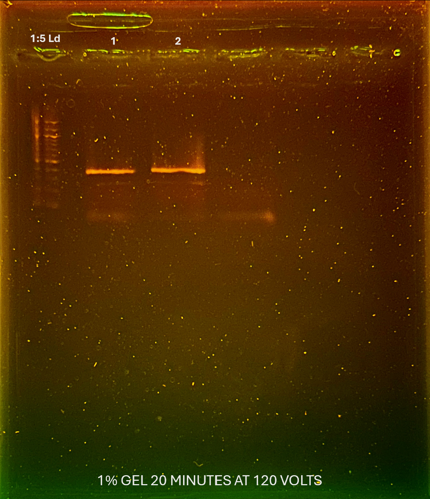

retrying ITS2 w/ 2 samples that were successful for Caroline 

Talked to Dr. Lee and she thinks it is either bad primers from freeze thaw or that I am not mixing enough. Since Caroline has been using primers that have been freeze thawed this entire time Caroline thinks it is the mixing.

| SampleNum | MonthYear | colony | Tubelabel_species          | Health_Status | Extracted | Raw_ng_ul | Extraction_physical_location | Extraction_notes | Condition | Caroline_ITS2 |
| --------- | --------- | ------ | -------------------------- | ------------- | --------- | --------- | ---------------------------- | ---------------- | --------- | ------------- |
| Sample 1  | 072024    | 1_7    | 072024_PAN_BDT_T1_558_SSID | Healthy       | 6_11_2026 | 11.7      | UML_PENGUIN_B3               |                  | CLP       | x             |
| Sample 2  | 072024    | 2_59   | 072024_PAN_BDT_T2_611_SSID | Healthy       | 6_11_2026 | 11.6      | UML_PENGUIN_B3               |                  | Healthy   | x             |
## Troubleshooting Checklist 
- Thoroughly pipetted all reagents & DNA with a larger setting then dialed down when actually adding it to master mix 
- checked every time that the reagent was inside the pipette tip before adding
- watched every pipette tip enter the liquid & full dumped out
- in each PCR tube mixed DNA & master mix with a p20 set to 15 uL (per Dr. Lee suggestion)
# 6/18/2026 Gel Image 

# Protocol
## I. PCR

| Reagent         | Amount per 1 rxn (uL) | MasterMix Amount (uL) + 5% |
| --------------- | --------------------- | -------------------------- |
| Buffer          | 5                     | 15.75                      |
| dNTP (10mM)     | 0.5                   | 1.575                      |
| F Primer (10uM) | 1                     | 3.15                       |
| R Primer (10uM) | 1                     | 3.15                       |
| DNA             | 1                     | 3.15                       |
| Polymerase      | 0.25                  | 0.7875                     |
| Water           | 16                    | 50.4                       |
| Albumin         | 0.25                  | 0.7875                     |
| Total           | 25                    | 78.75                      |

1. Create master mix for each sample
    1. after adding Buffer, dNTP, and Primers vortex master mix
    2. Pipette up and down to mix after adding polymerase and albumin, DO NOT vortex
2. Pipette 24uL of master mix into each replicate tube (3 replicates per sample)
3. Pipette 1uL of DNA into each replicate tube
    1. use new pipette tip for each replicate
4. briefly centrifuge pcr tubes before thermocycler
5. run thermocycler program:
    1. 98 for 30 sec
    2. **98 for 10 sec**
    3. **69 for 30 sec**
    4. **72 for 20 sec** _repeat 2-4 for 28 cycles (# of cycles varies depending on input)_
    5. 72 for 2 min
    6. 8 for Forever
## II. Gel electrophoresis 

### Gel electrophoresis preparation
- always use 1:5 dilution of DNA ladder on every row of gel
- TBE Buffer Recipe: https://github.com/GWLab-UML/Protocols/blob/main/Molecular_labwork/TBE_Buffer_Protocol.md
### Making and setting up a gel
1. calculating gel density:
    *% = weight (g) / volume (mL)*
2. mix agar and fresh TBE buffer to generate a 1% agarose gel that will be large enough for the gel mold
	*small gel mold: 25 mL
	medium gel mold: 50 mL
	large gel mold: 75 mL*
3. melt mixture (on hot plate with stir bar or microwave) until mixture has big bubbles and there's no floaters
4. add 2 µL GelRed to gel once cool to touch *(if you don't, you won't see your bands!!)*
5. Add the appropriate gel comb. Pour gel into the middle of mold and wait for even dispersion (enough gel to see that the wells are in it, but not too thick)
	*use a pipet tip to push away any bubbles* 
6. let gel cool *- wells will break if not cooled down enough - 20 mins to be safe 
### Loading gel sample prep
1. Cut enough parafilm for all samples + ladders
2. Pipette up 20uL (if less than 20 samples use 1x # of samples) of loading dye and place ~1uL dots of loading dye on the parafilm for each well/sample
3. turn rig so **DNA will move towards the positive electrode** (run towards red)!
4. load 2µL of DNA ladder at beginning or end *(or both if large rig)* of the gel, and on each row
	*mix ladder with dot of loading dye from parafilm*
5. load 1µL PCR product
	*mix sample with loading dye*
6. put cover on and turn on electric current - **run 110 volts for ~35 mins**
    - *check to make sure bands aren't running off the gel*
    - *time length depends on the size of gel 30-90 mins*
7. turn off electric current **then** remove lid
8. take picture of gel and save in lab notebook
    - *make sure to that ladder is clearly separated*
    - *editing: crop to be centered, brightness -100*
9. you may reuse gels up to 3 times, if so, break the gel up into a glass container that can be covered and store at 2-8 °C 
	*label how many times the gel was used on the lid*