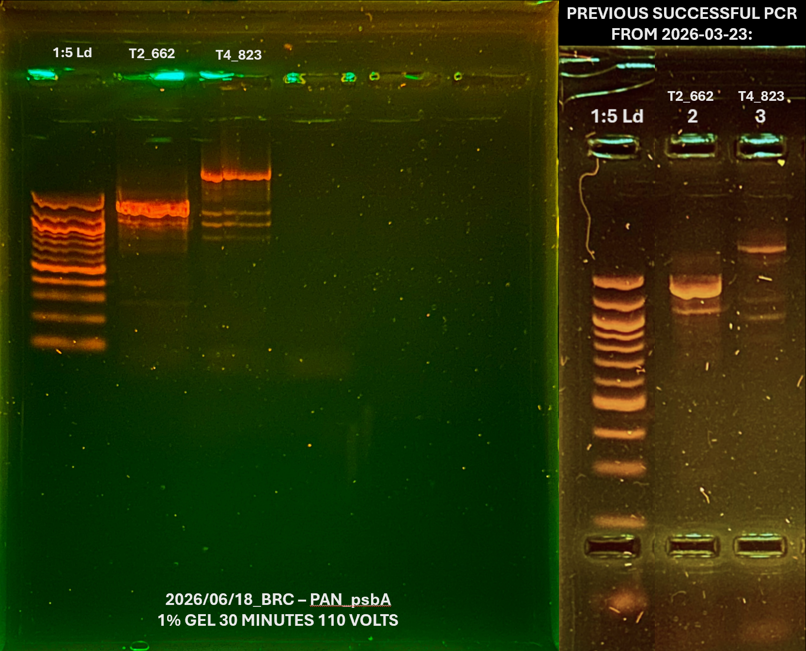

Retrying old successful psbA samples to see if I can still successfully do the protocol; the only thing I can currently think of that is going wrong with my ITS2 is that my buffer & DNTPs aren't mixed enough so I will try vortexing them before making my master mix 

**sample 1:** 1:10 072024_PAN_BDT_T2_662_OANN (75.4 ng/μL)
**sample 2:** 1:10 072024_PAN_BDT_T4_823_ORBI (15.2 ng/μL)
*note: using previously diluted samples to waste less DNA* 
## Troubleshooting Checklist 
- UVed water, added water first 
	- thought this would help with getting all of the regents out of the pipette tip 
- vortexed buffer, DNTPs, & Primers 
	- no bubble; I think the polymerase & albumin is what makes master mix bubbly 
- right before each reagent I pipetted up and down 20 times 
- since polymerase & albumin amounts were so small mixed with larger setting then dialed down when actually adding it to master mix 
- checked every time that the reagent was inside the pipette tip before adding
- watched every pipette tip enter the liquid & full dumped out 
- mixed master mix 30 times before adding to first PCR tube, then mixed 5 time between tubes 
- vortex and pipetted DNA up and down before adding to PCR tubes 
### notes: 
- Mastermix was really bubbly the first two PCR tubes were good but then the negative had a lot of bubbles and in trying to get them out some of it spilled out- less solution in negative 
- Originally added 24 uL of master mix to each tube, then took out 1 uL and added that to negative tube 
# 6/18/2026 Gel 

# Protocol
## I. PCR 
### PCR Preparation 
- thaw reagents & samples 
- UV & label PCR tubes (1 tube per sample)
- check that molecular water is aliquoted 
- include negative control (water) in calculations  
### Create master mix for each sample
copy and paste calculation table here: 

| Reagent         | Amount per 1 rxn (uL) | MasterMix Amount (uL) + 10% |
|-----------------|-----------------------|-----------------------------|
| Buffer          | 2.5                   | 8.25                        |
| dNTP (10mM)     | 0.5                   | 1.65                        |
| F Primer (10uM) | 1                     | 3.3                         |
| R Primer (10uM) | 1                     | 3.3                         |
| DNA             | 2                     | 6.6                         |
| Polymerase      | 0.125                 | 0.4125                      |
| Water           | 17.75                 | 58.575                      |
| Albumin         | 0.125                 | 0.4125                      |
| Total           | 25                    | 82.5                        |

1. Add Buffer, dNTP, and Primers vortex to Eppendorf tube. Vortex Briefly  
	*(DO NOT vortex polymerase or albumin)*
2. Add water, pipette up and down to mix.
3. Add polymerase and albumin, pipette mixture up and down to mix
	*albumin is viscous so pipet slowly*
4. Pipette 24µL of master mix into each replicate tube
	*always mix master mix by pipetting up and down before filling each tube*
5. Pipette 1µL of DNA into each tube
6. briefly centrifuge pcr tubes before thermal cycler
7. run thermocycler program: *35 cycles takes ~ 2 hours 21 minutes* 
    1. 95°C for 30 seconds
    2. 95°C for 30 seconds
    3. 45-68°C for 1 minute *(53.6°C optimal for clade D/B primers)*
    4. 68°C for 1.5 minute _repeat 2-4 for 35 cycles
    5. 68°C for 5 minutes
    6. 8°C for Forever
## II. Gel electrophoresis 

### Gel electrophoresis preparation
- always use 1:5 dilution of DNA ladder on every row of gel
- TBE Buffer Recipe: https://github.com/GWLab-UML/Protocols/blob/main/Molecular_labwork/TBE_Buffer_Protocol.md
### Making and setting up a gel
1. calculating gel density:
    *% = weight (g) / volume (mL)*
2. mix agar and fresh TBE buffer to generate a 1% agarose gel that will be large enough for the gel mold
	*small gel mold: 25 mL
	medium gel mold: 50 mL
	large gel mold: 75 mL*
3. melt mixture (on hot plate with stir bar or microwave) until mixture has big bubbles and there's no floaters
4. add 2 µL GelRed to gel once cool to touch *(if you don't, you won't see your bands!!)*
5. Add the appropriate gel comb. Pour gel into the middle of mold and wait for even dispersion (enough gel to see that the wells are in it, but not too thick)
	*use a pipet tip to push away any bubbles* 
6. let gel cool *- wells will break if not cooled down enough - 20 mins to be safe 
### Loading gel sample prep
1. Cut enough parafilm for all samples + ladders
2. Pipette up 20uL (if less than 20 samples use 1x # of samples) of loading dye and place ~1uL dots of loading dye on the parafilm for each well/sample
3. turn rig so **DNA will move towards the positive electrode** (run towards red)!
4. load 2µL of DNA ladder at beginning or end *(or both if large rig)* of the gel, and on each row
	*mix ladder with dot of loading dye from parafilm*
5. load 1µL PCR product
	*mix sample with loading dye*
6. put cover on and turn on electric current - **run 110 volts for ~35 mins**
    - *check to make sure bands aren't running off the gel*
    - *time length depends on the size of gel 30-90 mins*
7. turn off electric current **then** remove lid
8. take picture of gel and save in lab notebook
    - *make sure to that ladder is clearly separated*
    - *editing: crop to be centered, brightness -100*
9. you may reuse gels up to 3 times, if so, break the gel up into a glass container that can be covered and store at 2-8 °C 
	*label how many times the gel was used on the lid*
